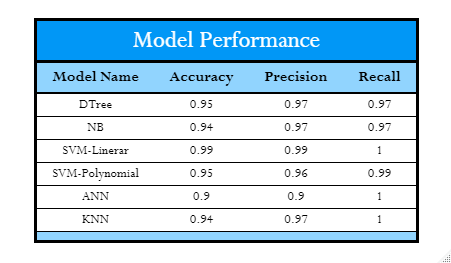
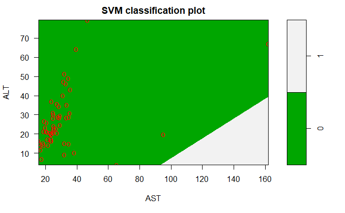
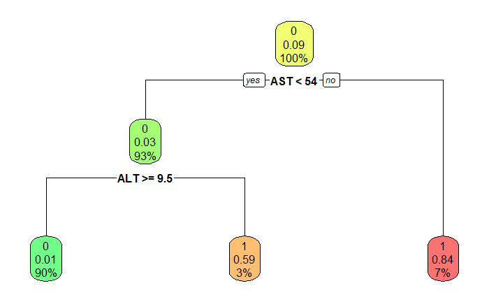

# Liver Disease Analysis

This project was to utilize a few different types of models and see which of them preform reasonably (if any).

## Analysis

Table for Predictive Modeling Performance

The best model based on accuracy visualized

A more reader friendly visual of the second best model based on accuracy

## Citation
>Data was obtained from the UCI repository. It can be found here: https://archive-beta.ics.uci.edu/dataset/571/hcv+data
